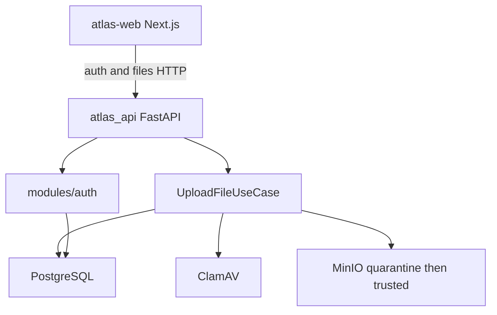

# Project Atlas — Current-State Analysis

This document describes **the repository as it exists today**. It is not the target architecture.

For product vision see [README.md](../README.md). For the intended long-term layout see [development-guide.md](development-guide.md). For the high-level pipeline stub see [architecture.md](architecture.md).

---

## 1. Summary

Project Atlas is designed as an AI-native knowledge engineering platform: ingest enterprise documents, process and enrich them, build a knowledge graph and vector index, and expose retrieval APIs.

**What is implemented now** is a smaller vertical slice:

- FastAPI auth (register, email OTP, JWT login)
- A secure file-acquisition pipeline (validation, ClamAV, MinIO quarantine/trusted storage, parsers, SHA-256 dedup, PostgreSQL + audit)
- A Next.js UI for landing, registration, OTP, login, and dashboard bulk upload

Most of the planned platform (processing, knowledge engineering, retrieval, Neo4j, Qdrant, Kafka, Temporal) is documentation-only or empty scaffolding.



---

## 2. Tech stack

| Layer | Technology |
|--------|------------|
| Language | Python 3.12 (`.python-version`, `pyproject.toml`) |
| Package manager | uv (`uv.lock`, `Makefile`) |
| API | FastAPI, uvicorn, python-multipart |
| Validation | Pydantic v2, email-validator |
| Database | PostgreSQL, SQLAlchemy 2 async, asyncpg |
| Object storage | MinIO |
| Antivirus | ClamAV (`clamd`) |
| Auth | pwdlib (Argon2), python-jose JWT, aiosmtplib OTP email |
| Document parsers | pypdf, python-docx, python-pptx, openpyxl |
| Frontend | Next.js 16.3, React 19, TypeScript 5, Tailwind CSS 4 |
| Quality | ruff, mypy (strict), pytest |
| Runtime | Docker Compose (API, web, Postgres, MinIO, ClamAV) |

Planned in `.env.example` but **not running in this repo**: Neo4j, Qdrant, Kafka, Temporal, LiteLLM, embeddings, OCR/Tesseract, Langfuse, OpenTelemetry.

---

## 3. Current repo map

```text
project-atlas/
├── atlas_api/                    # FastAPI entry + file HTTP adapters
│   ├── main.py                   # app factory, CORS, router includes
│   └── file_upload.py            # /api/files routes + DI wiring
├── modules/
│   ├── auth/                     # register, OTP, JWT login
│   ├── acquisition/
│   │   ├── file_upload/          # full layered upload module
│   │   ├── bulk_import/          # service exists; HTTP does not use it
│   │   ├── connectors/           # scaffold (PubMed stub commented out)
│   │   ├── crawler/              # scaffold
│   │   └── source_management/    # scaffold
│   └── shared/database/          # SQLAlchemy base, connection, create_tables
├── atlas-web/                    # Next.js App Router UI
├── tests/unit/acquisition/file_upload/
├── docs/
├── Dockerfile                    # API: uvicorn atlas_api.main:app :8000
├── docker-compose.yml
├── Makefile
├── pyproject.toml
├── create_security_buckets.py    # MinIO quarantine/trusted bootstrap
└── .env.example
```

The development guide describes `apps/`, `core/`, `workflows/`, and `infrastructure/` at the repo root. **Those folders are not in the tree.** The live API lives in `atlas_api/`, shared DB code in `modules/shared/database/`, and the web app in `atlas-web/` (not `apps/web/`).

---

## 4. What is implemented vs scaffold

### Implemented

| Area | Location | Behavior |
|------|----------|----------|
| HTTP app | `atlas_api/main.py` | FastAPI app, CORS for `http://localhost:3000`, includes auth + file routers |
| Auth | `modules/auth/` | Register, 6-digit OTP, resend OTP, JWT login |
| File upload | `modules/acquisition/file_upload/` | Layered domain/application/infrastructure + parsers + ClamAV + MinIO |
| File HTTP | `atlas_api/file_upload.py` | List, single upload, bulk upload (max 50 files, 100 MB each) |
| Frontend | `atlas-web/app/` | Landing, register, verify OTP, login, dashboard |
| Tests | `tests/unit/acquisition/file_upload/test_use_case.py` | Unit coverage for the upload use case |

### Scaffold only

| Area | Notes |
|------|--------|
| `modules/acquisition/crawler/` | Entities, repos, storage shells; no live crawler |
| `modules/acquisition/connectors/` | Mostly docstrings; PubMed client is commented out |
| `modules/acquisition/source_management/` | Placeholder domain/application/infrastructure |
| `modules/acquisition/bulk_import/` | `BulkImportService` exists but `/api/files/bulk` inlines its own loop |

### Not in the repo yet

Processing, knowledge engineering, retrieval, project management, evaluation, monitoring, dedicated audit module, `apps/` entry points, `core/`, `workflows/`, Alembic migrations, health checks.

Auth is implemented but **not applied** to file APIs.

---

## 5. API inventory

OpenAPI UI: `http://localhost:8000/docs`

### Authentication (`modules/auth/presentation/router.py`)

Prefix: `/api/auth`

| Method | Path | Body | Result |
|--------|------|------|--------|
| POST | `/api/auth/register` | `{ email, password }` (password 8–128 chars) | 201; creates `UserModel`, sends OTP |
| POST | `/api/auth/verify-otp` | `{ email, otp }` (6 digits) | Marks email verified |
| POST | `/api/auth/resend-otp` | `{ email }` | New OTP for unverified users |
| POST | `/api/auth/login` | `{ email, password }` | `{ access_token, token_type: "bearer" }` |

Login requires a verified email. Passwords are hashed with Argon2. JWT is created in `modules/auth/application/security.py`.

### Files (`atlas_api/file_upload.py`)

Prefix: `/api/files`

| Method | Path | Body | Result |
|--------|------|------|--------|
| GET | `/api/files?limit=50` | — | Recent uploads plus `count` and `total_size` |
| POST | `/api/files/upload` | multipart file | Single-file upload through `UploadFileUseCase` |
| POST | `/api/files/bulk` | multipart `files` | Up to 50 files; per-file success/error |

Limits: 100 MB per file, 50 files per bulk request. Limit on GET is clamped to 1–100.

**Auth gap:** the dashboard sends `Authorization: Bearer <token>` on bulk upload. File routes have no JWT `Depends` and are effectively public. GET `/api/files` sends no Authorization header from the UI.

There is no `/health` endpoint.

---

## 6. Frontend routes

The UI is a Next.js 16 App Router app in `atlas-web/`. There is no shared `components/` or API client layer; each page calls `fetch` directly.

| Route | File | Role |
|--------|------|------|
| `/` | `atlas-web/app/page.tsx` | Marketing landing; CTAs to login/register |
| `/register` | `atlas-web/app/register/page.tsx` | Email/password; stores email in `sessionStorage`; redirects to `/verify-otp` |
| `/verify-otp` | `atlas-web/app/verify-otp/page.tsx` | 6-digit OTP + resend |
| `/login` | `atlas-web/app/login/page.tsx` | Stores JWT in `sessionStorage`; redirects to `/dashboard` |
| `/dashboard` | `atlas-web/app/dashboard/page.tsx` | Client-side token gate, drag-and-drop bulk upload, recent files, storage stats |

Client storage keys: `atlas_access_token`, `atlas_user_email`, `atlas_registration_email`, `atlas_recent_uploads`.

Base URL:

- Dashboard uses `process.env.NEXT_PUBLIC_API_BASE_URL` or `http://localhost:8000`
- Login, register, and verify-otp **hard-code** `http://localhost:8000`

Root layout metadata is still the create-next-app default (“Create Next App”). `atlas-web/README.md` is stock Next.js boilerplate.

---

## 7. Upload pipeline

Owned by `UploadFileUseCase` in `modules/acquisition/file_upload/application/use_cases.py`.

```text
UPLOAD_STARTED
    → extension check
    → store in MinIO quarantine
    → file-signature validation
    → ClamAV scan
    → SHA-256 hash
    → duplicate check (get_by_sha256)
    → ParserFactory.parse
    → move to trusted bucket
    → persist FileUpload + audit events
    → UPLOAD_COMPLETED
```

On failure the use case deletes the quarantine (or trusted) object and writes `UPLOAD_REJECTED`.

Parsers (`modules/acquisition/file_upload/parsing/factory.py`):

| Extension | Parser |
|-----------|--------|
| `.pdf` | `PDFParser` |
| `.docx` | `DOCXParser` |
| `.pptx` | `PPTXParser` |
| `.xlsx` | `XLSXParser` |
| `.txt`, `.csv`, `.json`, `.xml`, `.html`, `.md`, `.eml`, others listed | `TextParser` |

Infrastructure adapters: `PostgreSQLFileUploadRepository`, `PostgreSQLAuditLogRepository`, `MinIOFileStorage`, `ClamAVScanner`.

Tables created by `modules/shared/database/create_tables.py`: `users`, `email_verification_otps`, `file_uploads`, `file_upload_audit_logs`.

---

## 8. How to run

### Local (Python + uv)

1. Copy env: `Copy-Item .env.example .env`
2. Set at least `DATABASE_URL`, `JWT_SECRET_KEY`, MinIO endpoint/keys, and (for OTP email) SMTP settings. The example file does not list all variables the code reads (see gaps below).
3. Install: `make setup` (`uv sync`)
4. Create tables: `uv run python modules/shared/database/create_tables.py`
5. Optional MinIO buckets: `uv run python create_security_buckets.py`
6. API: `make run` → `http://localhost:8000`
7. Web: `cd atlas-web && npm install && npm run dev` → `http://localhost:3000`

Quality gate: `make check` (ruff lint + format check + mypy + pytest).

### Docker Compose

From the repo root:

```bash
docker compose up --build
```

| Service | Host port | Role |
|---------|-----------|------|
| `app` | 8000 | FastAPI (`atlas-app`) |
| `web` | 3000 | Next.js (`NEXT_PUBLIC_API_BASE_URL=http://localhost:8000`) |
| `postgres` | 5433 → 5432 | DB `atlas_db`, user `postgres` / `root` |
| `minio` | 9000, console 9001 | Object storage |
| `clamav` | 3310 | Antivirus |

Compose does **not** run `create_tables.py` or `create_security_buckets.py` on startup. Those remain manual steps against the compose database and MinIO instance.

---

## 9. Known gaps

| Gap | Detail |
|-----|--------|
| Docs vs repo | README and `architecture.md` are vision stubs. `development-guide.md` describes `apps/`, `core/`, `workflows/`, and `modules/authentication/` — none of that matches `atlas_api/`, `modules/auth/`, or `atlas-web/`. |
| `.env.example` incomplete | Code uses `MINIO_BUCKET_QUARANTINE`, `MINIO_BUCKET_TRUSTED`, `CLAMAV_HOST` / `CLAMAV_PORT`, and SMTP vars. The example lists `MINIO_BUCKET_RAW/PROCESSED/EXPORTS` instead. Compose DB is `atlas_db` / `postgres:root`; the example uses `atlas` / `atlas`. |
| Auth on files | JWT is issued and the dashboard sends it on bulk upload, but `/api/files/*` does not validate it. |
| Config scatter | CORS is hardcoded in `atlas_api/main.py` (`http://localhost:3000`) even though `.env.example` has `CORS_ALLOWED_ORIGINS`. File-upload wiring uses `os.getenv` in the adapter, not a centralized settings object. |
| DB bootstrap | No Alembic. Schema is `create_tables.py` only. Compose does not migrate on start. |
| Bulk import | `BulkImportService` is unused by the HTTP bulk endpoint. |
| Frontend env | Auth pages ignore `NEXT_PUBLIC_API_BASE_URL`. |
| Testing | Guide mentions API/integration/workflow tests; only one unit test file exists. |
| Ops | No `/health`. No documented ClamAV/MinIO/SMTP runbook. |
| Dependencies | `python-dotenv` is used but not listed in `pyproject.toml` dependencies. `pydantic-settings` is listed but unused. |
| Stray file | `modules/acquisition/file_upload/parsing/code pdf_parser.py` sits beside `pdf_parser.py`. |

---

## 10. Related documents

| File | Role today |
|------|------------|
| [README.md](../README.md) | Vision and pipeline diagram only |
| [docs/architecture.md](architecture.md) | Same high-level diagram; no module map |
| [docs/development-guide.md](development-guide.md) | Team rules and **target** architecture |
| [atlas-web/README.md](../atlas-web/README.md) | Default create-next-app text |
